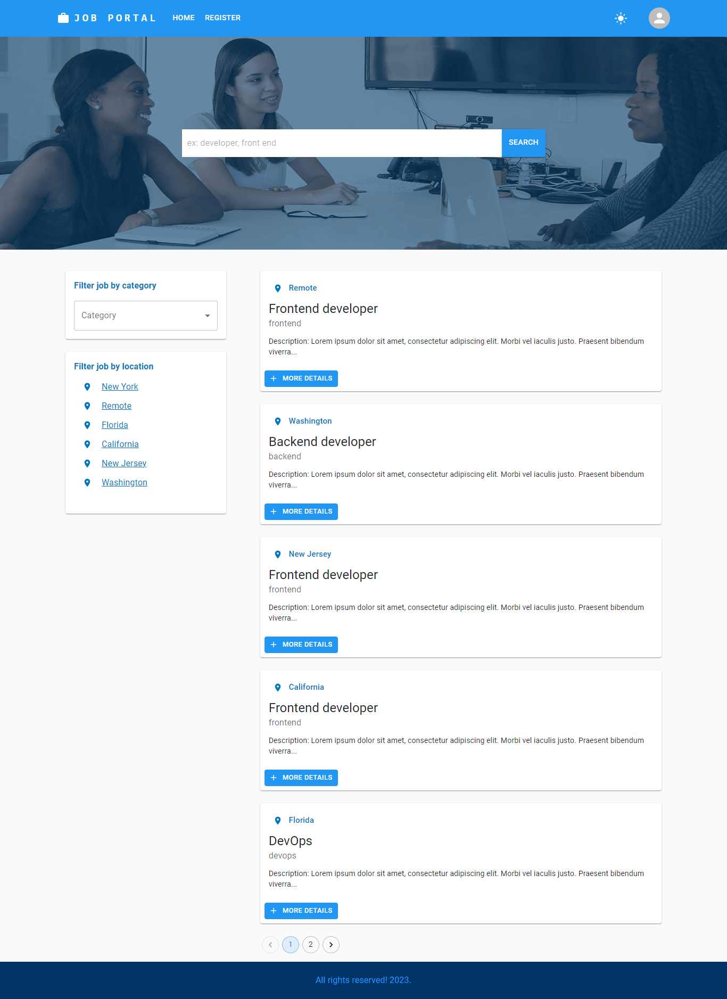
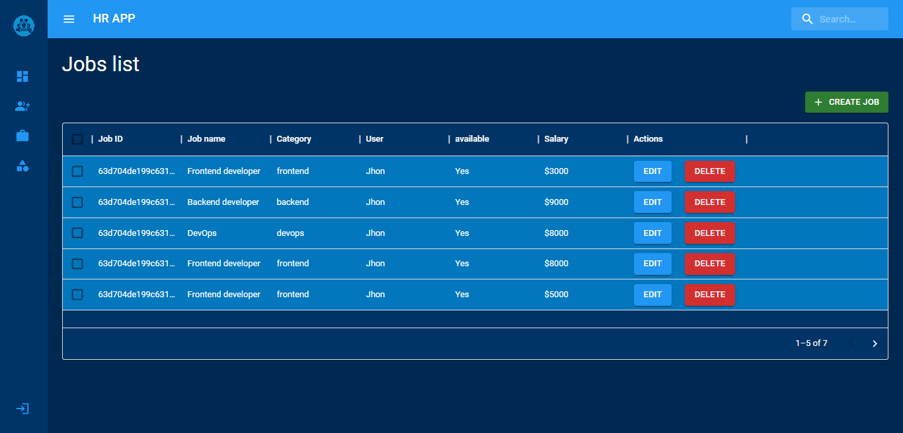

# job-portal-mern-stack
## About:
A Full Stack Job Portal application using MERN Stack along with material-UI, cookie, datagrid, formik-yup.

## Steps to run the app: 
* Clone the repo.
* Create a .env file in the main directory and set variables PORT=9000 DATABASE=YOUR_MONGO_URL JWT_SECRET=fidbfbFCDSm1558 NODE_ENV=development for development mode
and NODE_ENV=production if deploying the application.
* Run "npm install"

## Features:

### General Features:
* Register/ Log-in for Applicants and Recruiter/Admin.
* Authentication system implemented using JWT and cookie.
* Toast notification for major events.
* Change the theme between light and dark, implemented using Material-UI.
* Implemented pagination, download in CSV option.

### Features for Recruiter/Admin:
* Create jobs and job categories.
* Dashboard analytics for a created jobs - based on number of applicants applied, their location and other details.

### Features for Applicants:
* Search and apply for jobs.
* Filter for jobs based on category and location. 
* See the job history in the user dashboard.
* Dashboard analytics for applied jobs - based on salary levels, location and other details.

## Software Design Patterns used:
* Model-View-Controller (MVC) architecture pattern - to divide the program logic into three inter-related components.
* Higher Order Component (HOC) - technique used in React for reusing component logic.

## Screenshots of the application:

